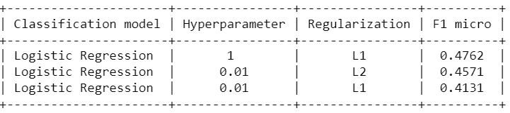

# Multi-Label Classification

## StackOverflow-Tag-prediction

Problem: Given the Title and body of a question on Stack overflow, predict the tags associated with the question.

<h1>Business Problem </h1>

<b> Description </b>

Stack Overflow is the largest, most trusted online community for developers to learn, share their programming knowledge, and build their careers. 
 
Stack Overflow is something which every programmer use one way or another. Each month, over 50 million developers come to Stack Overflow to learn, share their knowledge, and build their careers. It features questions and answers on a wide range of topics in computer programming. The website serves as a platform for users to ask and answer questions, and, through membership and active participation, to vote questions and answers up or down and edit questions and answers in a fashion similar to a wiki or Digg. As of April 2014 Stack Overflow has over 4,000,000 registered users, and it exceeded 10,000,000 questions in late August 2015. Based on the type of tags assigned to questions, the top eight most discussed topics on the site are: Java, JavaScript, C#, PHP, Android, jQuery, Python and HTML. 
 

<b> Source:  </b> https://www.kaggle.com/c/facebook-recruiting-iii-keyword-extraction/

<h1> Objectives </h1>
1. Predict as many tags as possible with high precision and recall. 
2. Incorrect tags could impact customer experience on StackOverflow. 
3. No strict latency constraints.

## Project name: Stack–Overflow Tag Prediction

### Strategy:

1. Libraries
2. Data Cleaning – Stage 1
3. Analysis of Tags
4. Tag Plots
5. Data Cleaning – Stage 2
6. Training Data
7. Testing Data
8. Machine Learning
9. Splitting the training Data
10. Tags Reduction
11. Removing no coverage
12. Featurizing data with TF-IDF vectorizer
13. Featurizing Labels
14. OneVsRest Classifier with SGDClassifier using TF-IDF

## Results

### Conclusion

* Exploratory data analysis was performed on the data set at first that gave many hints about the nature of data
* Data was cleaned, i.e. duplicates were removed, and other data cleaning and preprocessing steps like stemming were performed.
* It was found that out of the 42K tags that were originally in the data set, keeping the 5500 in consideration and discarding the rest would still correspond to more than 99% of the original information.
* Further, The OneVsRestClassifier was trained for the data with logistic regression with the default values accept for the regularization that was L1 in this case. The micro f1 score it yielded was approximately 0.47 and the precision and recall were also fair values(approximately 0.56 and 0.41 respectively).
* Then, for the same model, some hyperparameter tuning was performed, with different values of C(0.001,0.01,1,100,1000) and the 3 fold cross validation with GridSearchCV yielded 0.01 to be the best value. Which then yielded precision:0.7072, Recall:0.3376 and F1-measure(micro):0.4571, when L2 regularization was used.
* When L1 regularization was used then the metrics were, Precision: 0.7174, Recall: 0.2901, F1-measure: 0.4131

### Credits:

1. https://www.kaggle.com/c/facebook-recruiting-iii-keyword-extraction
2. https://www.appliedaicourse.com/
